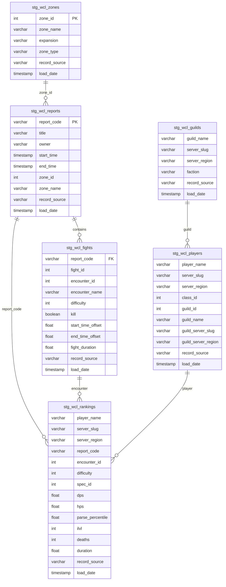
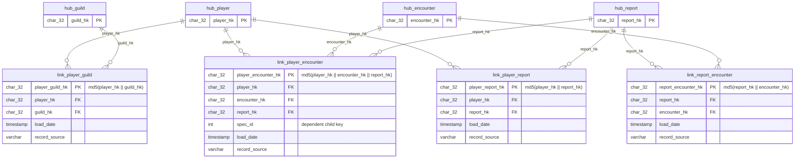
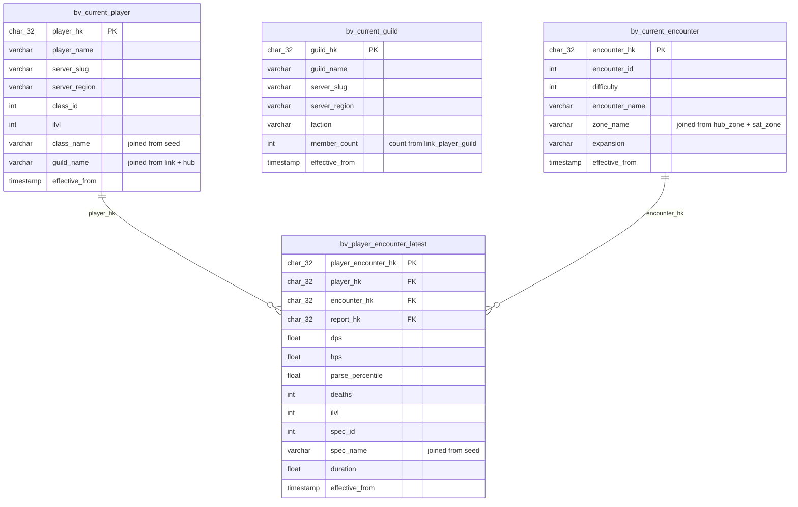
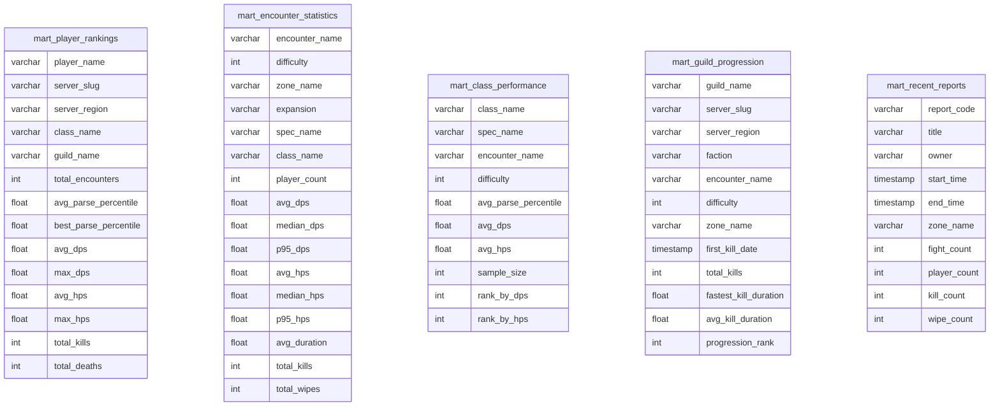
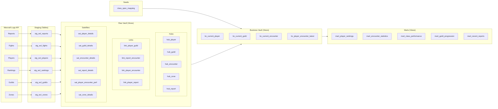
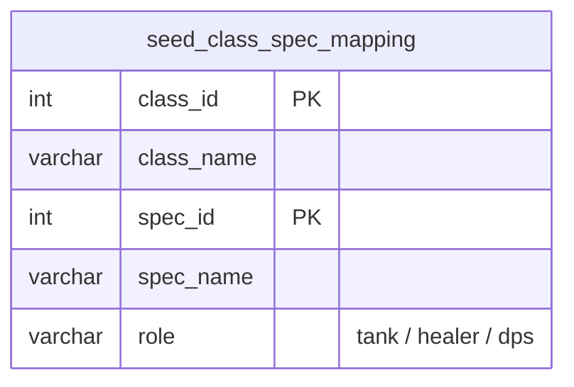

# Data Model — ER Diagrams

> **Materialization strategy:** Staging tables are materialized as `table` (physical). Raw vault, business vault, and marts are materialized as `view` to minimize storage on the free tier.

---

## 1. Staging Layer (Materialized Tables)

Raw data landed from Warcraft Logs API. These are the only physical tables besides seeds.

---

## 2. Raw Vault Layer (Views)

Data Vault 2.0 modeled as views over staging tables. Hash keys computed at query time.

### Hubs

```mermaid
erDiagram
    hub_player {
        char_32 player_hk PK "md5(player_name || server_slug || server_region)"
        varchar player_name
        varchar server_slug
        varchar server_region
        timestamp load_date
        varchar record_source
    }

    hub_guild {
        char_32 guild_hk PK "md5(guild_name || server_slug || server_region)"
        varchar guild_name
        varchar server_slug
        varchar server_region
        timestamp load_date
        varchar record_source
    }

    hub_encounter {
        char_32 encounter_hk PK "md5(encounter_id || difficulty)"
        int encounter_id
        int difficulty
        timestamp load_date
        varchar record_source
    }

    hub_zone {
        char_32 zone_hk PK "md5(zone_id)"
        int zone_id
        timestamp load_date
        varchar record_source
    }

    hub_report {
        char_32 report_hk PK "md5(report_code)"
        varchar report_code
        timestamp load_date
        varchar record_source
    }
```

### Links

### Satellites

```mermaid
erDiagram
    hub_player {
        char_32 player_hk PK
    }
    hub_guild {
        char_32 guild_hk PK
    }
    hub_encounter {
        char_32 encounter_hk PK
    }
    hub_report {
        char_32 report_hk PK
    }
    hub_zone {
        char_32 zone_hk PK
    }
    link_player_encounter {
        char_32 player_encounter_hk PK
    }

    sat_player_details {
        char_32 player_hk FK
        char_32 hashdiff "md5(player_name || server_slug || class_id || ilvl)"
        varchar player_name
        varchar server_slug
        varchar server_region
        int class_id
        int ilvl
        timestamp load_date
        varchar record_source
    }

    sat_guild_details {
        char_32 guild_hk FK
        char_32 hashdiff "md5(guild_name || server_slug || faction)"
        varchar guild_name
        varchar server_slug
        varchar server_region
        varchar faction
        timestamp load_date
        varchar record_source
    }

    sat_encounter_details {
        char_32 encounter_hk FK
        char_32 hashdiff "md5(encounter_name || kill || fight_duration)"
        varchar encounter_name
        boolean kill
        float fight_duration
        timestamp load_date
        varchar record_source
    }

    sat_report_details {
        char_32 report_hk FK
        char_32 hashdiff "md5(title || owner || start_time || end_time || zone_id)"
        varchar title
        varchar owner
        timestamp start_time
        timestamp end_time
        int zone_id
        timestamp load_date
        varchar record_source
    }

    sat_player_encounter_performance {
        char_32 player_encounter_hk FK
        char_32 hashdiff "md5(dps || hps || parse_pct || deaths || ilvl || spec_id)"
        float dps
        float hps
        float parse_percentile
        int deaths
        int ilvl
        int spec_id
        float duration
        timestamp load_date
        varchar record_source
    }

    sat_zone_details {
        char_32 zone_hk FK
        char_32 hashdiff "md5(zone_name || expansion || zone_type)"
        varchar zone_name
        varchar expansion
        varchar zone_type
        timestamp load_date
        varchar record_source
    }

    hub_player ||--o{ sat_player_details : "player_hk"
    hub_guild ||--o{ sat_guild_details : "guild_hk"
    hub_encounter ||--o{ sat_encounter_details : "encounter_hk"
    hub_report ||--o{ sat_report_details : "report_hk"
    hub_zone ||--o{ sat_zone_details : "zone_hk"
    link_player_encounter ||--o{ sat_player_encounter_performance : "player_encounter_hk"
```

---

## 3. Business Vault Layer (Views)

Resolved current-state views that pick the latest satellite record per business key.

---

## 4. Mart Layer (Views)

Consumption-ready views for the frontend. Queried by Next.js Server Actions with filters.

---

## 5. Full Data Flow

---

## 6. Seed Data

